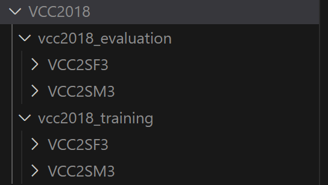

# MaskCycleGAN-VC Experiment

본 레포지토리는 원본 코드를 쉽게 실험할 수 있도록 수정한 버전입니다.

코드에 대해 자세히 이해하고 싶으시다면 아래의 paper 및 original repo link를 참고해주세요.

Paper: https://arxiv.org/pdf/2102.12841.pdf

Original repo link(non-official): https://github.com/GANtastic3/MaskCycleGAN-VC


## 코드 베이스 다운 및 아나콘다 환경 설정

Clone the repository

```
git clone https://github.com/chaksseu/MaskCycleGAN-VC.git
cd MaskCycleGAN-VC
```

아나콘다 환경 설정 및 필요 패키지 설치

```
conda env create -f environment.yml
conda activate MaskCycleGAN-VC
pip install -r requirements.txt
```


## 데이터셋 준비

아래 링크에서 학습 데이터 및 테스트 데이터를 다운받을 수 있습니다.
https://datashare.ed.ac.uk/handle/10283/3061

1. `training data for building parallel and non-parallel VC systems released to participants (117.0Mb)` 파일 다운로드 및 압축해제
2. `evaluation data (source speaker's data) released to participants (31.79Mb)` 파일 다운로드 및 압축해제
3. ` evaluation data (target speaker's data) used as reference in listening tests (15.98Mb)`파일 다운로드 및 압축해제
4. vcc2018폴더를 생성하고 압축해제한 폴더들을 넣습니다.
5. vcc2018_reference 폴더 내의 파일을 모두 vcc2018_evaluation으로 옮긴 후 폴더를 삭제합니다.

<p align="center">

<br>
<b>데이터셋 폴더 구조 예시</b>

</p>

추가로 개별적인 데이터셋을 학습에 이용하시려면, vcc2018_evaluation 폴더와 vcc2018_training 폴더 아래에 원하시는 화자 이름을 폴더를 생성하신 후, 그 안에 해당 화자의 wav파일를 넣어주시면 됩니다.

vcc2018_training -> 모델 훈련에 사용되는 데이터셋

vcc2018_evaluation -> 모델 테스트에 사용되는 데이터셋

## 데이터 전처리

```
python data_preprocessing/preprocess_vcc2018.py --data_directory vcc2018/vcc2018_training --preprocessed_data_directory vcc2018_preprocessed/vcc2018_training --speaker_ids VCC2SF2 VCC2SM2
```

```
python data_preprocessing/preprocess_vcc2018.py --data_directory vcc2018/vcc2018_evaluation --preprocessed_data_directory vcc2018_preprocessed/vcc2018_evaluation --speaker_ids VCC2SF2 VCC2SM2
```

`--speaker_ids`의 화자 데이터셋이 전처리됩니다.

전처리 데이터 저장 위치: `'/vcc2018_preprocessed/vcc2018_evaluation', '/vcc2018_preprocessed/vcc2018_training'`


## 모델 학습

`<speaker_A_id>`를 source로 `<speaker_B_id>`를 target으로 하는 모델을 학습시킵니다. 최소 수백 epoch 이상의 학습을 권장합니다.

```
python -W ignore::UserWarning -m mask_cyclegan_vc.train --name mask_cyclegan_vc_<speaker_id_A>_<speaker_id_B> --seed 0 --save_dir results --preprocessed_data_dir vcc2018_preprocessed/vcc2018_training --speaker_A_id <speaker_A_id> --speaker_B_id <speaker_B_id> --epochs_per_save 10 --epochs_per_plot 10 --num_epochs 6172 --batch_size 1 --decay_after 1e4 --sample_rate 22050 --num_frames 64 --max_mask_len 25 --gpu_ids 0
```

학습된 모델 저장 위치: `'/results/mask_cyclegan_vc_<speaker_id_A>_<speaker_id_B>/ckpts'`

학습/테스트 데이터 에러 그래프 생성/확인 방법: 

`'/results/mask_cyclegan_vc_<speaker_id_A>_<speaker_id_B>/mask_cyclegan_vc_<speaker_id_A>_<speaker_id_B>.log'`파일 값을 make_loss_graph.py 파일의 data에 삽입 후 해당 파이썬 파일 실행

```
<노트북/서버에서 각각 학습 시간 (6172epoch 기준)>

화자 2명(one-to-one), 화자당 81문장의 경우: 노트븍(cpu): 대략 520시간, 서버(gpu): 52시간
```

## 모델 테스트 (오디오 생성)

훈련시킨 MaskCycleGAN-VC 모델을 evaluation dataset으로 test합니다. 

converted audio는 다음 위치에 저장됩니다. `results/mask_cyclegan_vc_<speaker_id_A>_<speaker_id_B>/converted_audio`.

```
python -W ignore::UserWarning -m mask_cyclegan_vc.test --name mask_cyclegan_vc_<speaker_A_id>_<speaker_B_id> 
--save_dir results/ --preprocessed_data_dir vcc2018_preprocessed/vcc2018_evaluation --gpu_ids 0 --speaker_A_id <speaker_A_id> --speaker_B_id <speaker_B_id> --ckpt_dir /data1/cycleGAN_VC3/mask_cyclegan_vc_<speaker_A_id>_<speaker_B_id>/ckpts --load_epoch <recent epoch> --model_name generator_A2B
```

MCD 확인 방법: 
- target 화자가 source의 문장을 말한 wav파일이 gt_wav가 됩니다.
- ex) A화자의 1번 문장을 Source로 B화자의 2번문장을 Target으로 Voice Conversion을 진행한 경우, B화자의 1번 문장이 gt_wav가 되며, 모델을 통해 변환한 음성이 converted_wav가 됩니다.
- gt_wav와 converted_wav의 mcd값을 측정
```
# 새로운 conda 환경 생성 및 python 파일 실행
conda create -n mcd python==3.8
conda activate mcd
pip install pymcd tqdm
# 'cal_pymcd.py'에서 GT path와 Converted path 설정 후
python cal_pymcd.py
```

결과 파일 재생 방법: `results/mask_cyclegan_vc_<speaker_id_A>_<speaker_id_B>/converted_audio`에서 원하는 wav파일을 다운받아 재생